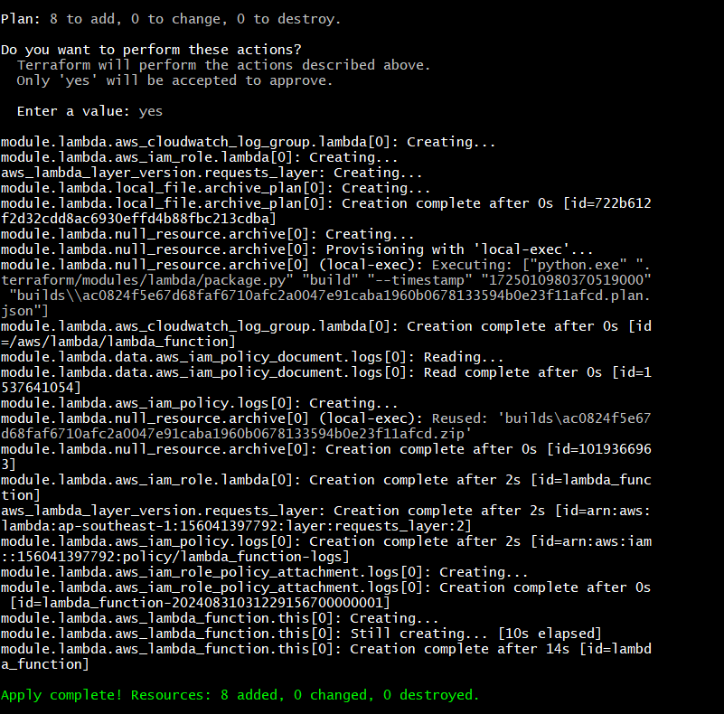
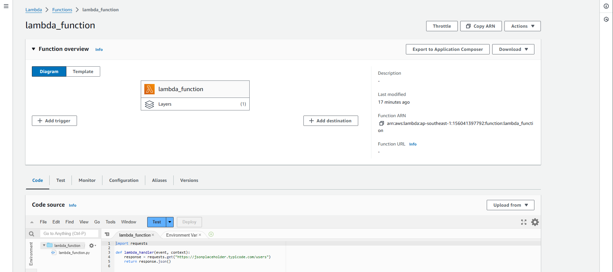
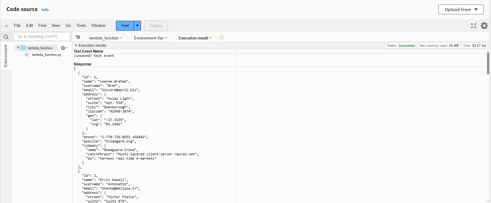

# Setup

1. Clone the repository

```bash
git clone https://github.com/Sele3/assessment2.git
cd assessment2
```

2. Add AWS credentials

```bash
aws configure
```

3. Initialize Terraform

```bash
terraform init
```

4. Deploy the infrastructure

```bash
terraform apply
yes
```

5. Destroy the infrastructure (After testing)

```bash 
terraform destroy
yes
```

# Screenshots

## Terraform Apply


Screenshot of the Terraform apply command.

## AWS Console


Screenshot of the AWS Console showing the Lambda function created through Terraform.

## AWS Lambda Invoke

  
Screenshot of the response from invoking the Lambda function.

# Using the `terraform-aws-modules/lambda/aws` Module

Used the [terraform-aws-modules/lambda/aws](https://github.com/terraform-aws-modules/terraform-aws-lambda) module to create the Lambda function. Simplifies deployment by following AWS best practices and saving time compared to creating custom modules or provisioning resources directly.
